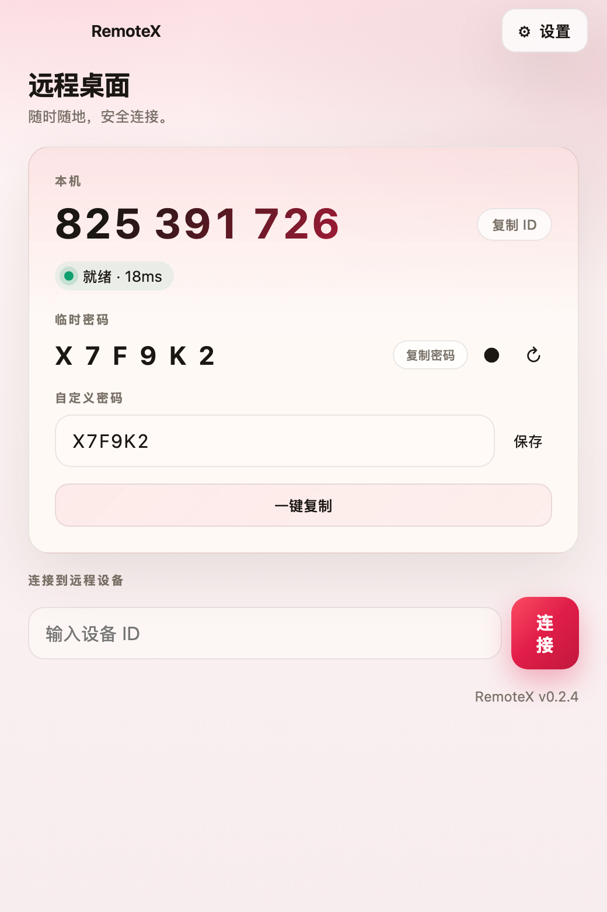
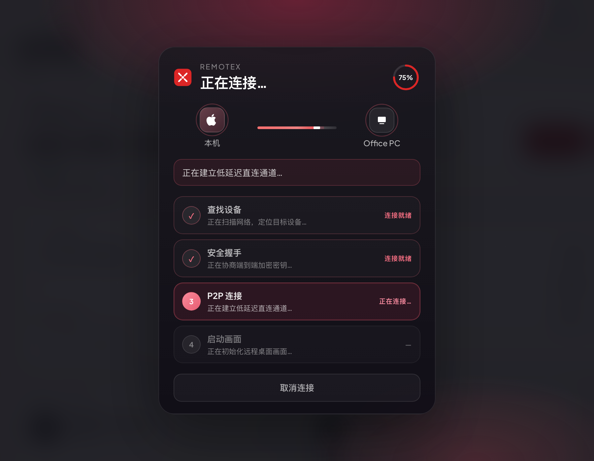
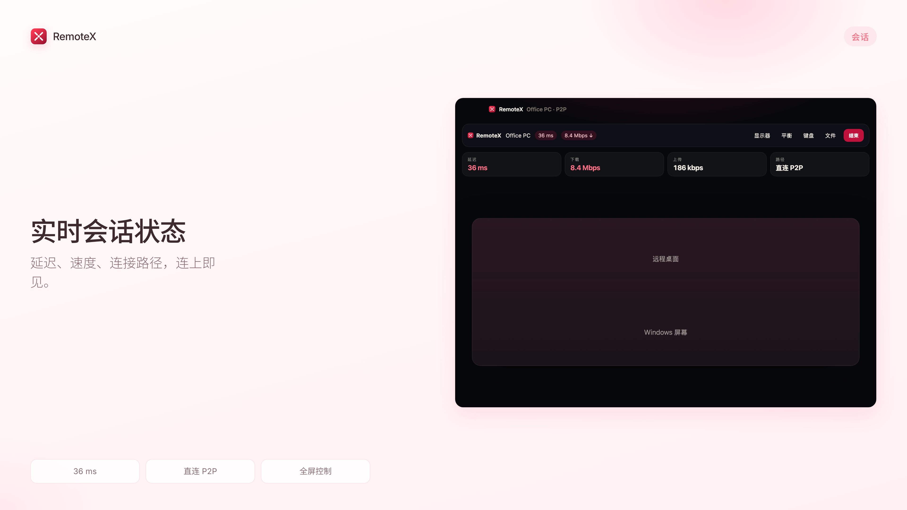

# RemoteX

**Fast Remote Desktop.** No account. No setup. Just connect.

## 下载 Download

官网 / Website：[https://linux503.github.io/RemoteX/](https://linux503.github.io/RemoteX/)

安装包 / Releases：[GitHub Releases](https://github.com/linux503/RemoteX/releases/latest)

| 系统 | 文件 |
|------|------|
| macOS | `RemoteX_*_universal.dmg` — 拖进「应用程序」 |
| Windows | `RemoteX_*_x64-setup.exe` — 当前用户安装 |

## 使用

1. 两台电脑都打开 RemoteX  
2. 输入对方 **设备码** 和 **临时密码**  
3. 同一 Wi-Fi 下可在首页看到附近设备，点一下即可连接  

## 说明

- 无需注册，无需登录  
- Windows ↔ macOS 跨平台  
- macOS 首次使用请在设置里完成屏幕录制等权限  

更多截图见 [官网产品页](https://linux503.github.io/RemoteX/#shots)。
